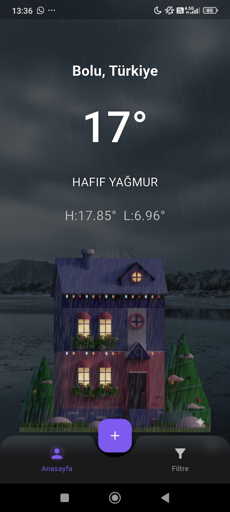
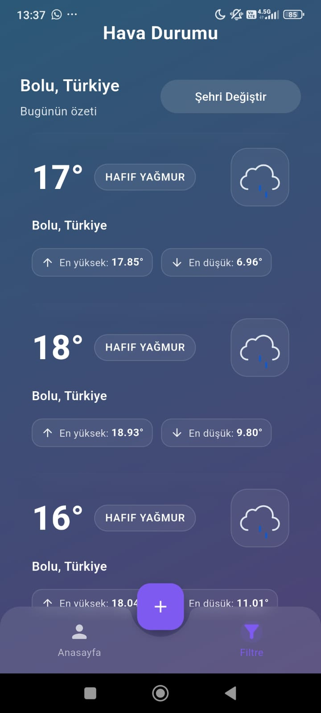
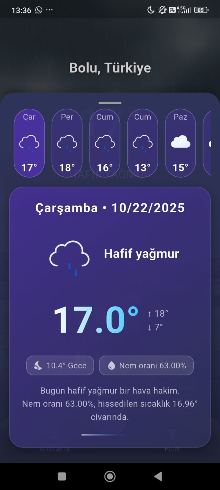
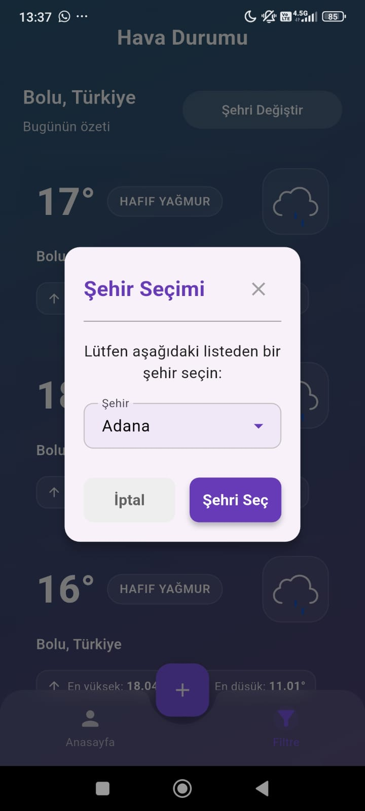

# 🌦️ Weather App

Flutter ile geliştirilmiş modern hava durumu uygulaması.  
**Riverpod**, **Dio**, **Freezed**, **GoRouter** ve **FlexColorScheme** gibi güçlü teknolojilerle esnek, ölçeklenebilir ve kullanıcı dostu bir yapı sunar.

---

## 🚀 Özellikler

- 📍 **Konum tabanlı hava durumu** (Geolocator & Geocoding)
- 🔍 **Şehir arama ve seçim** (Dropdown Search)
- 🌐 **Dio** ile hızlı ve güvenilir API entegrasyonu
- ⚙️ **.env dosyasıyla güvenli API anahtarı yönetimi** (flutter_dotenv)
- 🧩 **Riverpod State Management**
- 🧱 **Freezed & Json Serializable** ile otomatik model üretimi
- 🧭 **GoRouter** ile modern yönlendirme
- 🎨 **FlexColorScheme** ile özelleştirilebilir tema yönetimi
- 🌍 **easy_localization** ile çoklu dil desteği
- ✨ **animate_do** ve **lottie** ile dinamik animasyonlar
- 🎯 **HexColor** ile kolay renk tanımlama

---

## 📸 Ekran Görüntüleri

> Görselleri `assets/img/` klasörüne ekleyebilirsin.  
> Aşağıdaki tablo örnek olarak hazırlanmıştır.

| 🌤️ Anasayfa | 🔍 Şehir Arama | 📊 Detay Sayfası | 📊 Şehir Seçme Sayfası |
|-------------|----------------|-----------------|-----------------|
|  |  |  |  |

---

## 🛠️ Kullanılan Teknolojiler

| Kategori | Paketler |
|-----------|-----------|
| **State Management** | riverpod, flutter_riverpod, riverpod_annotation, riverpod_generator |
| **Model Üretimi** | freezed, json_serializable, json_annotation, build_runner |
| **Ağ (Networking)** | dio |
| **Tema & UI** | flex_color_scheme, animate_do, dropdown_search, hexcolor, lottie |
| **Yerelleştirme** | easy_localization |
| **Konum Servisleri** | geolocator, geocoding |
| **Yönlendirme** | go_router |
| **Yapılandırma** | flutter_dotenv |

---

## 📦 Kurulum

```bash
git clone https://github.com/<kullaniciadi>/weather_app.git
cd weather_app
flutter pub get
flutter pub run build_runner build --delete-conflicting-outputs
flutter run
